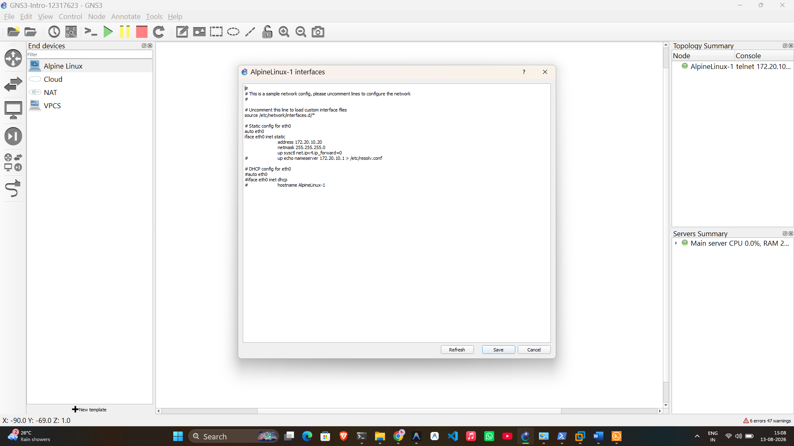
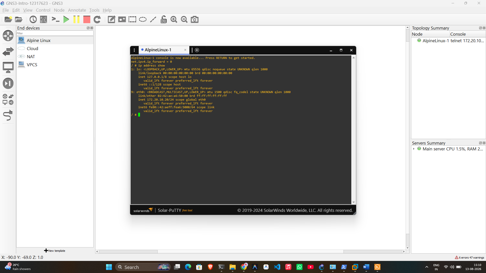

# Week 01 Portfolio – COIT20261 Network Technologies

**Name:** Karthik Murakonda
**Student ID:** 12317623
**Date:** 13 August 2026
**Unit:** COIT20261 – Network Technologies

---

## Section A – Unit Setup

### GitHub Repository
Created a private GitHub repository named `12317623-Murakonda-COIT20261-2026T2` and shared it with the tutor.

### Software Installed
- VirtualBox (virtualization software to run the GNS3 VM)
- GNS3 (network simulator, accessed via the VirtualBox VM web interface)

---

## Section B – Task 1: Introduction to GNS3 Basics

### Aim
Quick familiarisation with GNS3 project creation, adding and configuring the IP address of a node, adding annotations, starting/stopping a node, and running Linux commands in a web console.

### Activities Completed

1. Created a new GNS3 project named `GNS3-Intro-12317623`
2. Added a single **Alpine Linux** node (AlpineLinux-1) as the Linux Host
3. Added text annotations showing the project title, name, student ID, and date
4. Selected IP address **172.20.10.20** for the node
5. Added text annotation near the node showing the IP address
6. Configured the node with a static IP address using `/etc/network/interfaces` before starting:

```
auto eth0
iface eth0 inet static
        address 172.20.10.20
        netmask 255.255.255.0
        up sysctl net.ipv4.ip_forward=0
```

7. Started the node and opened the web console
8. Ran `ip address show` to verify the IP address was correctly configured

### Network Configuration Used

| Node | Interface | IP Address | Subnet Mask |
|------|-----------|-----------|-------------|
| AlpineLinux-1 | eth0 | 172.20.10.20 | 255.255.255.0 |

### Commands Used

```bash
# Show IP address of all interfaces
ip address show
```

### Outputs

- **Project file:** `GNS3-Intro-12317623.gns3project`
- **Network screenshot:** `GNS3-Intro-12317623-network.png`
- **Console screenshot:** `GNS3-Intro-12317623-ipaddress.png`

### Screenshots


*Figure 1: GNS3 canvas showing the /etc/network/interfaces configuration for AlpineLinux-1*


*Figure 2: Console output of `ip address show` confirming the static IP 172.20.10.20/24 on eth0*

### Learnings and Observations

- GNS3 uses Docker-based Alpine Linux containers as Linux Host nodes
- The `/etc/network/interfaces` file must be configured **before** starting the node so the IP is applied automatically on startup
- The `ip address show` command displays all network interfaces and their assigned IP addresses
- `net.ipv4.ip_forward=0` disables IP forwarding, which is the correct setting for a host (not a router)
- The node title in the Topology Summary panel shows the telnet connection IP used by GNS3 to manage the node (e.g., 172.20.10...) which is separate from the node's own configured IP
