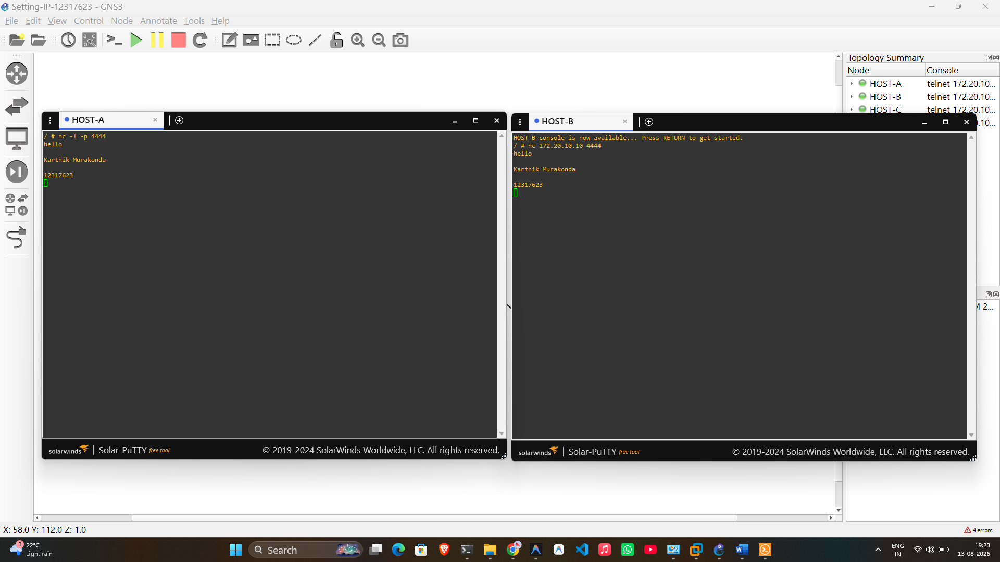

# Week 03 Portfolio – COIT20261 Network Technologies

**Name:** Karthik Murakonda
**Student ID:** 12317623
**Date:** 13 August 2026
**Unit:** COIT20261 – Network Technologies

---

## Task 1: Simple Application Communications with Netcat

### Aim
Learn the basics of netcat (`nc`) to test simple application-layer communications between two hosts.

### Network Used
- **Project:** `Netcat-Basics-12317623` (based on `Setting-IP-12317623`)
- **Network:** `172.20.10.0/24`
- **Hosts:** HOST-A, HOST-B, HOST-C (and HOST-D)

### IP Address Assignments

| Host | Interface | IP Address |
|------|-----------|-----------|
| HOST-A | eth0 | 172.20.10.10/24 |
| HOST-B | eth0 | 172.20.10.11/24 |
| HOST-C | eth0 | 172.20.10.22/24 |

### Activities Completed

1. Opened the existing `Setting-IP-12317623` project containing 4 hosts and a switch
2. Started the **netcat server** on HOST-A listening on port **4444**:

```bash
# On HOST-A (Server)
nc -l -p 4444
```

3. Connected the **netcat client** on HOST-B to HOST-A:

```bash
# On HOST-B (Client)
nc 172.20.10.10 4444
```

4. Both consoles showed a blank prompt indicating a successful connection.

5. Sent the **name** from client (HOST-B) to server (HOST-A):
```
Karthik Murakonda
```

6. Sent the **student ID** from server (HOST-A) to client (HOST-B):
```
12317623
```

7. Both messages were visible on both consoles, confirming bidirectional communication.

8. Stopped netcat on both sides using **Ctrl-D**.

### Commands Used

```bash
# Start server (HOST-A) — listens on port 4444
nc -l -p 4444

# Start client (HOST-B) — connects to server IP and port
nc 172.20.10.10 4444

# To stop: press Ctrl-D at both client and server
```

### Outputs

- **Project file:** `Netcat-Basics-12317623.gns3project`
- **Screenshot:** `Netcat-Basics-12317623-client-server.png`

### Screenshots


*Figure 1: Side-by-side view of HOST-A (server, left) and HOST-B (client, right). Both show the exchanged messages: "Karthik Murakonda" (name) and "12317623" (student ID).*

### Netcat vs Ping

| Feature | Ping | Netcat |
|---------|------|--------|
| Protocol | ICMP (Network Layer) | TCP/UDP (Application Layer) |
| Direction | Source only initiates | Both sides can send |
| Use case | Reachability & RTT | Application connectivity testing |
| Requires server | No | Yes |

### Learnings and Observations
- Netcat (nc) operates at the application layer using TCP, making it a more thorough connectivity test than ping
- The server must be started **before** the client attempts to connect
- Messages typed on the client appear on the server console and vice versa, showing true bidirectional communication
- Port 4444 was used (tutorial required a port other than 12345)
- To screenshot both consoles simultaneously, one browser tab was moved to a separate browser window and arranged side-by-side
- Both `nc` and `netcat` refer to the same program; Alpine Linux uses `nc`

---

## Task 2: Capturing Packets

### Aim
Capture packets on a network link in GNS3 and transfer the capture file to the Windows host computer.

### Activities Completed

1. Used the same `Setting-IP-12317623` project with 4 hosts and 1 switch
2. **Started packet capture** on the link between HOST-A and Switch1:
   - Right-clicked the link → **Start capture**
   - Selected interface type: **Ethernet**
   - Named the file with `.pcap` extension

3. Ran a ping from HOST-A to HOST-B (3 requests):
```bash
ping -c 3 172.20.10.11
```

4. Used netcat to send name from HOST-A to HOST-C:
```bash
# HOST-C (server)
nc -l -p 4444

# HOST-A (client)
nc 172.20.10.22 4444
# Typed: Karthik Murakonda
```

5. **Stopped the capture** by right-clicking the link → **Stop capture**

6. Located the capture file on the GNS3 server:
```
/opt/gns3/projects/<project-uuid>/project-files/captures/
```

7. Transferred the `.pcap` file to Windows using **FileZilla**:
   - Host: GNS3 VM IP address
   - Protocol: SFTP (SSH)
   - Username: `gns3`
   - Password: `gns3`
   - Navigated to `/opt/gns3/projects/` → found project folder → `project-files/captures/`
   - Dragged the file to Windows

### Commands Used

```bash
# Ping from HOST-A to HOST-B (3 packets)
ping -c 3 172.20.10.11

# Netcat on HOST-C (server)
nc -l -p 4444

# Netcat on HOST-A (client, send name)
nc 172.20.10.22 4444
```

### Outputs

- **Capture file:** `Capture-Basics-12317623-ping-netcat.pcap`

### Learnings and Observations
- GNS3 can capture packets on any link by right-clicking it, allowing traffic analysis without additional hardware
- Packet captures are saved as `.pcap` files on the GNS3 VM, not directly accessible from Windows
- FileZilla with SFTP is used to transfer files from the GNS3 VM (Linux) to the Windows host
- The capture file contains both ICMP packets (from ping) and TCP packets (from netcat), demonstrating different protocol types
- Opening the `.pcap` file in Wireshark would allow inspection of individual packets, including their headers and payloads
- GNS3 organises projects using unique UUIDs as folder names, so the correct project folder must be located by checking which one contains the named project file

