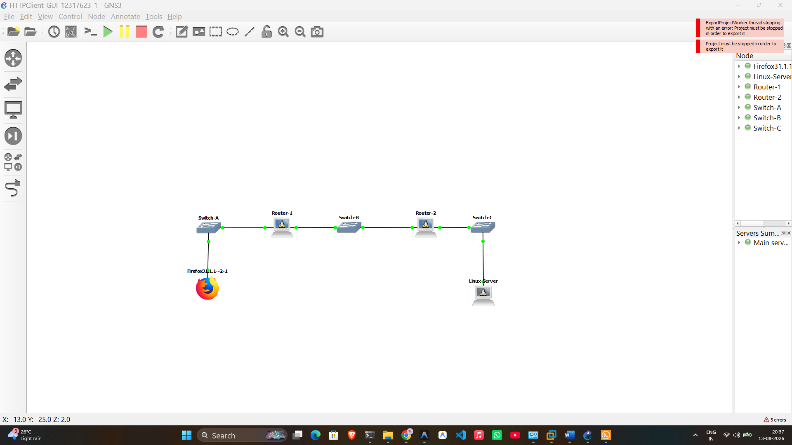
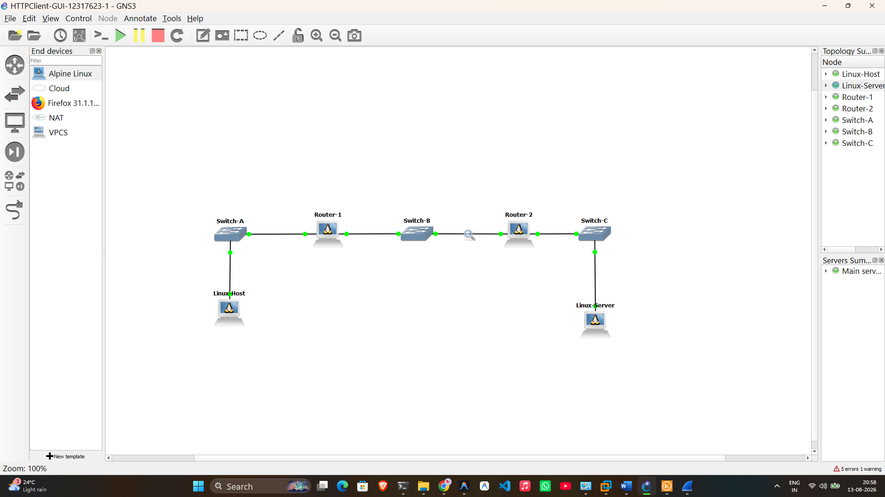
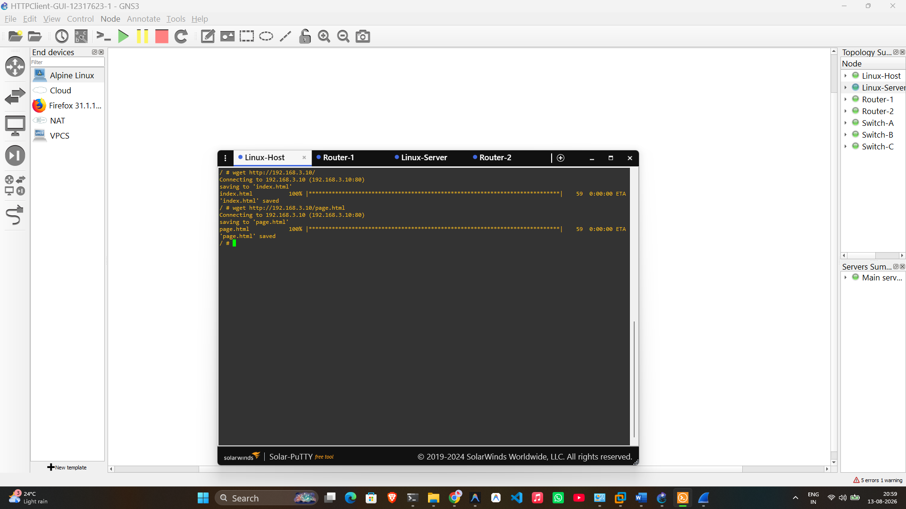

# Week 04 Portfolio – COIT20261 Network Technologies

**Name:** Karthik Murakonda
**Student ID:** 12317623
**Date:** 13 August 2026
**Unit:** COIT20261 – Network Technologies

---

## Task 1: HTTP Client with GUI (Firefox via VNC)

### Aim
Use a GUI web browser (Firefox) inside GNS3 via VNC to access a web server and explore HTTP traffic.

### Network Topology

```
[Firefox31.1.1] ── Switch-A ── Router-1 ── Switch-B ── Router-2 ── Switch-C ── Linux-Server
     Subnet A                                Subnet B                             Subnet C
  192.168.1.0/24                          192.168.2.0/24                       192.168.3.0/24
```

### Nodes Used

| Node | Type | Role |
|------|------|------|
| Firefox31.1.1~2-1 | QEMU Firefox | HTTP Client (GUI) |
| Router-1 | Alpine Linux (2 adapters) | Router between Subnet A and B |
| Router-2 | Alpine Linux (2 adapters) | Router between Subnet B and C |
| Linux-Server | Alpine Linux | HTTP Server |
| Switch-A | Ethernet Switch | Subnet A switch |
| Switch-B | Ethernet Switch | Subnet B switch |
| Switch-C | Ethernet Switch | Subnet C switch |

### IP Address Assignments

| Device | Interface | IP Address | Gateway |
|--------|-----------|-----------|---------|
| Firefox Host | eth0 | 192.168.1.10/24 | 192.168.1.1 |
| Router-1 | eth0 | 192.168.1.1/24 | — |
| Router-1 | eth1 | 192.168.2.1/24 | — |
| Router-2 | eth0 | 192.168.2.2/24 | — |
| Router-2 | eth1 | 192.168.3.1/24 | — |
| Linux-Server | eth0 | 192.168.3.10/24 | 192.168.3.1 |

### Activities Completed

1. Created project `HTTPClient-GUI-12317623` with 3 subnets connected via 2 routers
2. Configured static IP addresses and default gateways on all nodes via `/etc/network/interfaces`
3. Enabled `ip_forward=1` on both Router-1 and Router-2
4. Added static routes on routers to reach non-directly-connected subnets:
   - Router-1: route to Subnet C via Router-2
   - Router-2: route to Subnet A via Router-1
5. Verified connectivity with `ping` between all nodes across subnets
6. Started packet capture on the link between Router-1 and Switch-B (Subnet B)
7. Used **noVNC** to open Firefox on the Firefox Host node
8. Browsed to `http://192.168.3.10` in Firefox — the Linux Server's web page loaded
9. Stopped the packet capture
10. Transferred the `.pcap` file to Windows using FileZilla

### Web Server Setup
The Linux-Server used BusyBox's built-in HTTP server (no installation needed):
```bash
mkdir -p /tmp/www
echo "<html><body><h1>Linux Server COIT20261</h1></body></html>" > /tmp/www/index.html
while true; do
  { echo -e "HTTP/1.1 200 OK\r\nContent-Type: text/html\r\nConnection: close\r\n\r\n"; cat /tmp/www/index.html; } | nc -l -p 80
done
```

### Commands Used

```bash
# Enable IP forwarding on routers
sysctl net.ipv4.ip_forward=1

# Add static routes (Router-1: reach Subnet C)
ip route add 192.168.3.0/24 via 192.168.2.2

# Add static routes (Router-2: reach Subnet A)
ip route add 192.168.1.0/24 via 192.168.2.1

# Verify routing table
ip route show

# Ping across subnets to test connectivity
ping 192.168.3.10
```

### Outputs

- **Project file:** `HTTPClient-GUI-12317623.gns3project`
- **Network screenshot:** `HTTPClient-GUI-12317623-network.png`
- **Packet capture:** `HTTPClient-GUI-12317623-subnetB.pcap`

### Screenshots


*Figure 1: GNS3 topology showing Firefox Host, 2 Routers, 3 Switches, and Linux-Server across 3 subnets*

### Learnings and Observations
- A multi-router network requires **static routes** on each router so it knows how to reach subnets it is not directly connected to
- HTTP operates over TCP port 80. A web browser (HTTP client) sends a GET request to the server, and the server responds with HTML content
- The Firefox QEMU node requires KVM acceleration; on VirtualBox this may need to be disabled in GNS3 settings (`enable_kvm = false`)
- Packet capture on Subnet B captures traffic between the two routers, showing HTTP requests and responses traversing the network

---

## Task 2: HTTP Client with Command Line Interface

### Aim
Use command line HTTP clients (`wget` and `curl`) to access a web server, replacing the GUI Firefox browser.

### Network Changes from Task 1
- Removed **Firefox31.1.1** host from Subnet A
- Added **Linux-Host** (Alpine Linux) with the **same IP** as Firefox Host: `192.168.1.10/24`

### Activities Completed

1. Copied project `HTTPClient-GUI-12317623` and saved as `HTTPClient-CLI-12317623`
2. Replaced the Firefox node with a standard Alpine Linux host (same IP configuration)
3. Started all nodes and confirmed connectivity with ping
4. Started packet capture on Subnet B link
5. Used **`wget`** on Linux-Host to download the web server's pages:

```bash
wget http://192.168.3.10/
wget http://192.168.3.10/page.html
```

6. Stopped packet capture — transferred to Windows
7. Used **`curl`** to access the web server (no packet capture):

```bash
curl http://192.168.3.10/
```

### wget Output (from screenshot)
```
Connecting to 192.168.3.10 (192.168.3.10:80)
saving to 'index.html'
index.html    100% |████████████████| 59 0:00:00 ETA
'index.html' saved

Connecting to 192.168.3.10 (192.168.3.10:80)
saving to 'page.html'
page.html     100% |████████████████| 59 0:00:00 ETA
'page.html' saved
```

Both files (59 bytes each) were successfully downloaded from the server.

### wget vs curl Comparison

| Feature | wget | curl |
|---------|------|------|
| Default action | Save to file | Print to stdout |
| Save output | Automatic | Requires `-o filename` |
| Use case | Downloading files | Testing/automation |
| Posting data | Limited | Full support |

### Outputs

- **Project file:** `HTTPClient-CLI-12317623.gns3project`
- **Network screenshot:** `HTTPClient-CLI-12317623-network.png`
- **Packet capture:** `HTTPClient-CLI-12317623-subnetB.pcap`
- **CLI screenshot:** `HTTPClient-CLI-12317623-wget-curl.png`

### Screenshots


*Figure 2: GNS3 topology with Linux-Host replacing Firefox, same 3-subnet architecture*


*Figure 3: wget successfully downloading index.html and page.html from Linux-Server at 192.168.3.10*

### Learnings and Observations
- `wget` is simpler for downloading — it saves files automatically without extra options
- `curl` is more powerful for API testing and sending data to a server (POST requests)
- Both tools generate the same HTTP GET request as a browser, making them useful for automated testing
- A command line HTTP client avoids the CPU/RAM overhead of a full GUI browser
- The packet capture on Subnet B showed identical HTTP packets regardless of whether Firefox or wget was used as the client — the HTTP protocol is the same
- The server IP `192.168.3.10` is in Subnet C, requiring packets to traverse both Router-1 and Router-2 (3 hops from Linux-Host to Server)

